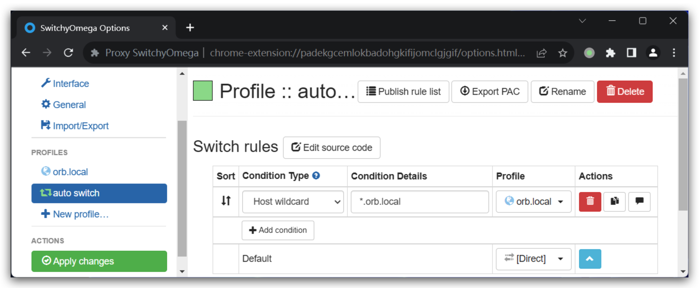

# hadoop-testing

This serves as a testing sandbox for Hadoop, equipped with fundamental components
of the Hadoop ecosystem to facilitate the rapid establishment of test environments.

# Components

The supported components are listed below:

* Hadoop (3.3.6)
* Hive (2.3.9)
* Iceberg (1.4.2)
* Hudi (0.14.1)
* Kyuubi (1.8.0)
* Spark (3.4.2)
* Flink (1.18.1)
* ZooKeeper (3.8.3)
* Ranger (2.4.0)
* Grafana (9.5.2)
* Prometheus (latest)
* Loki (2.8.0)
* Kafka (2.8.1)
* MySQL (8.0)

## JDK

* JDK 8 (1.8.0.392, default)
* JDK 17 (17.0.9)
* JDK 21 (21.0.1)

## How to use

Download all required artifacts, which will be used for building Docker images.

This scripts will download a large amount of artifacts, depending on your network bandwidth,
it may take a few minutes or even hours to complete. You can also download them manually and
put them into the `download` directory, the scripts won't download them again if they already
exist.
```
./download.sh
```

Build docker images
```
./build-image.sh
```

Run the testing plagground
```
docker compose up
```

## Access services

### Networks

For macOS users, it's recommended to use [OrbStack](https://docs.orbstack.dev/) as the container runtime. OrbStack provides an out-of-box [container domain name resolving feature](https://docs.orbstack.dev/docker/domains) to allow accessing each container via `<container-name>.orb.local`.

For other platforms, we provide a socks5 server in a container named `socks5`, which listens 18070 port and is exposed to the dockerd host by default, you can forward traffic to this socks server to access services run in other containers.

For example, to access service in Browser, use [SwitchyOmega](https://github.com/FelisCatus/SwitchyOmega) to forward traffic of `*.orb.local` to `<dockerd-hostname>:18070`.





### Service endponits

Once the testing environment is fully operational, the following services will be accessible:

- Grafana: http://grafana.orb.local:3000
- Prometheus: http://prometheus.orb.local:9090
- Kyuubi UI: http://hadoop-master1.orb.local:10099
- Spark History Server: http://hadoop-master1.orb.local:18080
- Flink History Server: http://hadoop-master1.orb.local:8082
- Hadoop HDFS: http://hadoop-master1.orb.local:9870
- Hadoop YARN: http://hadoop-master1.orb.local:8088
- Hadoop MapReduce JobHistory: http://hadoop-master1.orb.local:19888
- Ranger Admin: http://hadoop-master1.orb.local:6080 (admin/Ranger@admin123)


## Roadmap

1. Add more components, such as LDAP, Kerberos, Flink, HBase, etc.
2. This project is in very early stage, and the current way is not flexiable enough to support various testing scenarios.
For example, there is no switch to turn on/off each components by configuration. To address such issues, we may want
to leverage the template engine like Ansible plus Jinja2 to generate the docker-compose.yml file and configuration files
for each component, so that user could easily customize the testing environment by modifying the configurations.
