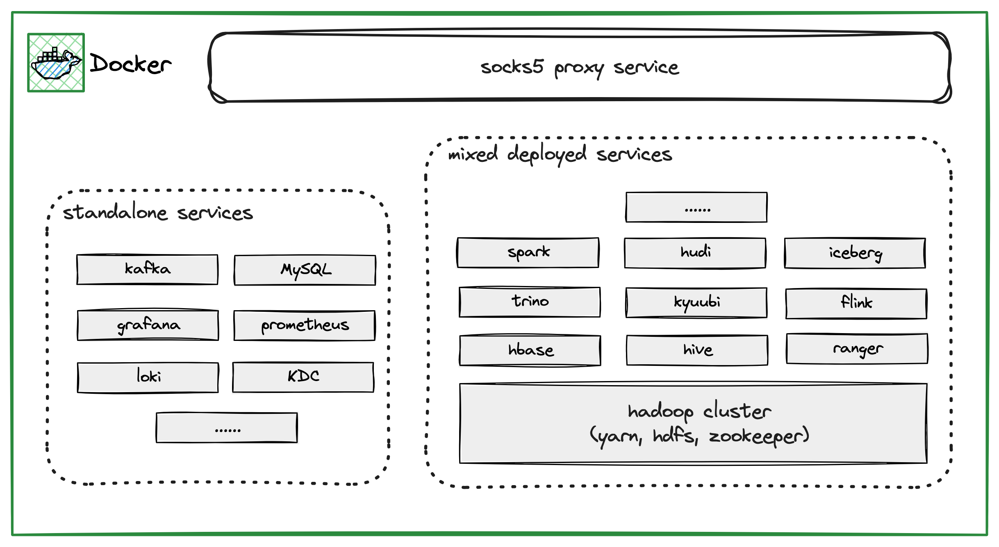

Hadoop Testing
==============
This serves as a testing sandbox for Hadoop, equipped with fundamental components
of the Hadoop ecosystem to facilitate the rapid establishment of test environments.

We try to deploy a big data ecosystem in multiple Docker containers to simulate the production environment. Generally speaking, it contains two types of deployment modes(standalone and mixed deployed). Standalone mode is just like a SaaS service provided by cloud vendors, while the mixed deployed mode is just like the semi-managed EMR service of cloud vendors. The whole deployment architecture is shown below:



> Draw by [excalidraw](https://excalidraw.com/)

## Features

* Realistic simulation of production environment;
* Kerberos ready, and optional;
* Lightweight, highly scalable and tailored Hadoop ecosystem;
* Multi-purpose, multi-scenario, suitable for:
   - Component developer: unit and integration testing;
   - DevOps engineer: parameter adjustment verification, compatibility testing of component upgrades;
   - Solution architect: Sandbox simulation of migration work, work shop demonstration;
   - Data ETL engineer: a test environment that is easy to build and destroy;

## Components

The supported components are listed below:

| Name           | Version | Kerberos Ready | Note |
| -------------- | ------- | -------------- | ---- |
| Hadoop HDFS    | 3.3.6   | Yes            |      | 
| Hadoop YARN    | 3.3.6   | Yes            |      |
| Hive Metastore | 2.3.9   | Yes            |      |
| HiveServer2    | 2.3.9   | Yes            |      |
| Kyuubi         | 1.8.1   | Yes            |      |
| Spark          | 3.4.2   | Yes            |      |
| Flink          | 1.18.1  | Not Yet        |      |
| Trino          | 436     | Not Yet        |      |
| Ranger         | 2.4.0   | Not Yet        |      |
| ZooKeeper      | 3.8.3   | Not Yet        |      |
| Kafka          | 2.8.1   | Not Yet        |      |
| MySQL          | 8.0     | No             |      |
| Grafana        | 9.5.2   | No             |      |
| Prometheus     | latest  | No             |      |
| Loki           | 2.8.0   | No             |      |
| Iceberg        | 1.4.2   | No             |      |
| Hudi           | 0.14.1  | No             |      |

### JDK

* JDK 8 (1.8.0.392, default)
* JDK 17 (17.0.9)
* JDK 21 (21.0.1)

## Prepare

This project uses [Ansible](https://www.ansible.com/) to render the Dockerfile, shell scripts, and configuration files from the templates. Please make sure you have installed it before building.

### (Optional, Recommended) Install pyenv

Considering, ansible strongly depends on the Python environment. To make the Python environment independent and easy to manage, it is recommended to use [pyenv-virtualenv](https://github.com/pyenv/pyenv-virtualenv) to manage Python environment. 

Here we provide guides for macOS and CentOS users.

#### macOS

Install from Homebrew

```bash
brew install pyenv pyenv-virtualenv
```

Append to `~/.zshrc`, and perform `source ~/.zshrc` or open a new terminal to take effect.

```bash
eval "$(pyenv init -)"
eval "$(pyenv virtualenv-init -)"
```

#### CentOS

Before installing, we need to install some required packages.

```bash
yum install gcc make patch zlib-devel bzip2 bzip2-devel readline-devel sqlite sqlite-devel openssl-devel tk-devel libffi-devel xz-devel
```

Then, install pyenv:

```bash
curl https://pyenv.run | bash

# or

curl -L https://raw.githubusercontent.com/pyenv/pyenv-installer/master/bin/pyenv-installer | bash
```

If you use `bash`, add it into `~/.bash_profile` or `~/.bashrc`:

```bash
export PYENV_ROOT="$HOME/.pyenv"
[[ -d $PYENV_ROOT/bin ]] && export PATH="$PYENV_ROOT/bin:$PATH"
eval "$(pyenv init -)"
```

Add it into `~/.bashrc`:

```bash
eval "$(pyenv virtualenv-init -)"
```

After all, source `~/.bash_profile` and `~/.bashrc`.

### (Optional) Configure SSH

This step allows you to ssh all the `hadoop-*` containers from your host, then can use ansible to control all the `hadoop-*` containers.

The macOS should have pre-installed `nc`, and you can manually install `nc` on CentOS using the following command:

```bash
yum install epel-release && yum install -y nc
```

Then configure the `~/.ssh/config` file in your host:

```bash
Host hadoop-*
    Hostname %h.orb.local
    User root
    Port 22
    ForwardAgent yes
    IdentityFile ~/.ssh/id_rsa_hadoop_testing
    StrictHostKeyChecking no
    ProxyCommand nc -x 127.0.0.1:18070 %h %p
```

**Note** : DO NOT forget to reduce access permission by invoking this command:

```bash
chmod 600 ~/.ssh/id_rsa_hadoop_testing
```

After all the containers have been launched, test the controllability via this command:

```bash
ansible-playbook ping.yaml
```

It should print all nodes' OS information (include host and hadoop related containers).

If not, use `-vvv` config option to debug it.

### Use pyenv

Create virtualenv

```bash
pyenv install 3.9
pyenv virtualenv 3.9 hadoop-testing
```

Localize virtualenv

```bash
pyenv local hadoop-testing
```

Install packages to the isolated virtualenv

```
pip install -r requirements.txt
```

## How to use

Firstly, use ansible to render some build files(`download.sh`, `.env`, `compose.yaml`...).

```
ansible-playbook playbook.yaml
```

By default, all services disable authN, you can enable Kerberos by passing the `kerberos_enabled` variable:
```
ansible-playbook playbook.yaml -e "{kerberos_enabled: true}"
```

You can add `-vvv` arg to debug the playbook:

```
ansible-playbook playbook.yaml -vvv
```

Download all required artifacts, which will be used for building Docker images.

This scripts will download a large amount of artifacts, depending on your network bandwidth,
it may take a few minutes or even hours to complete. You can also download them manually and
put them into the `download` directory, the scripts won't download them again if they already
exist.

```
./download.sh
```

Build docker images
```
./build-image.sh
```

Run the testing plagground
```
docker compose up
```

## Access services

### Networks

For macOS users, it's recommended to use [OrbStack](https://docs.orbstack.dev/) as the container runtime. OrbStack provides an out-of-box [container domain name resolving feature](https://docs.orbstack.dev/docker/domains) to allow accessing each container via `<container-name>.orb.local`.

For other platforms, we provide a socks5 server in a container named `socks5`, which listens 18070 port and is exposed to the dockerd host by default, you can forward traffic to this socks server to access services run in other containers.

For example, to access service in Browser, use [SwitchyOmega](https://github.com/FelisCatus/SwitchyOmega) to forward traffic of `*.orb.local` to `<dockerd-hostname>:18070`.


### Service endponits

Once the testing environment is fully operational, the following services will be accessible:

- Grafana: http://grafana.orb.local:3000
- Prometheus: http://prometheus.orb.local:9090
- Kyuubi UI: http://hadoop-master1.orb.local:10099
- Spark History Server: http://hadoop-master1.orb.local:18080
- Flink History Server: http://hadoop-master1.orb.local:8082
- Hadoop HDFS: http://hadoop-master1.orb.local:9870
- Hadoop YARN: http://hadoop-master1.orb.local:8088
- Hadoop MapReduce JobHistory: http://hadoop-master1.orb.local:19888
- Ranger Admin: http://hadoop-master1.orb.local:6080 (admin/Ranger@admin123)
- Trino Web UI: http://hadoop-master1.orb.local:18081 (admin/)


## Roadmap

1. Add more components, such as LDAP, HBase, Zeppelin etc.
2. Fully templatized. Leverage Ansible and Jinja2 to templatize the Dockerfiles, shell scripts, and configuration files, so that users can easily customize the testing environment by modifying the configurations, e.g. only enabling a subset of components, and changing the version of the components.
3. Provide user-friendly docs, with some basic tutorials and examples, e.g. how to create a customized testing environment, how to run some basic examples, how to add a new component, etc.
