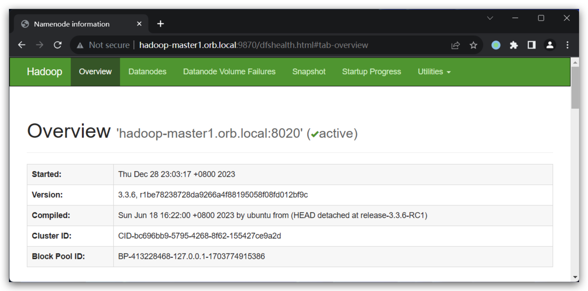

# hadoop-testing

This serves as a testing sandbox for Hadoop, equipped with fundamental components
of the Hadoop ecosystem to facilitate the rapid establishment of test environments.

# Prepare

This project uses [ansible](https://www.ansible.com/) to build. Please make sure you have installed it before building.

Considering, ansible strongly depends on the Python environment. To make the Python environment independent and easy to manage, it is recommended to use `pyenv` and `virtualenv` to manage Python environment.

# Components

The supported components are listed below:

* Hadoop (3.3.6)
* Hive (2.3.9)
* Iceberg (1.4.2)
* Hudi (0.14.1)
* Kyuubi (1.8.0)
* Spark (3.4.2)
* Flink (1.18.1)
* Trino (436)
* ZooKeeper (3.8.3)
* Ranger (2.4.0)
* Grafana (9.5.2)
* Prometheus (latest)
* Loki (2.8.0)
* Kafka (2.8.1)
* MySQL (8.0)

## JDK

* JDK 8 (1.8.0.392, default)
* JDK 17 (17.0.9)
* JDK 21 (21.0.1)

## How to use

Firstly, use ansible to render some build files(`download.sh`, `.env`, `compose.yaml`...).

```
ansible-playbook playbook.yaml
```

You can add `-vvv` arg to debug the playbook:

```
ansible-playbook playbook.yaml -vvv
```

Download all required artifacts, which will be used for building Docker images.

This scripts will download a large amount of artifacts, depending on your network bandwidth,
it may take a few minutes or even hours to complete. You can also download them manually and
put them into the `download` directory, the scripts won't download them again if they already
exist.

```
./download.sh
```

Build docker images
```
./build-image.sh
```

Run the testing plagground
```
docker compose up
```

## Access services

### Networks

For macOS users, it's recommended to use [OrbStack](https://docs.orbstack.dev/) as the container runtime. OrbStack provides an out-of-box [container domain name resolving feature](https://docs.orbstack.dev/docker/domains) to allow accessing each container via `<container-name>.orb.local`.

For other platforms, we provide a socks5 server in a container named `socks5`, which listens 18070 port and is exposed to the dockerd host by default, you can forward traffic to this socks server to access services run in other containers.

For example, to access service in Browser, use [SwitchyOmega](https://github.com/FelisCatus/SwitchyOmega) to forward traffic of `*.orb.local` to `<dockerd-hostname>:18070`.


### Service endponits

Once the testing environment is fully operational, the following services will be accessible:

- Grafana: http://grafana.orb.local:3000
- Prometheus: http://prometheus.orb.local:9090
- Kyuubi UI: http://hadoop-master1.orb.local:10099
- Spark History Server: http://hadoop-master1.orb.local:18080
- Flink History Server: http://hadoop-master1.orb.local:8082
- Hadoop HDFS: http://hadoop-master1.orb.local:9870
- Hadoop YARN: http://hadoop-master1.orb.local:8088
- Hadoop MapReduce JobHistory: http://hadoop-master1.orb.local:19888
- Ranger Admin: http://hadoop-master1.orb.local:6080 (admin/Ranger@admin123)
- Trino Web UI: http://hadoop-master1.orb.local:18081 (admin/)



## Roadmap

1. Add more components, such as LDAP, Kerberos, HBase, etc.
2. Fully templatized. Leverage Ansible and Jinja2 to templatize the Dockerfiles, shell scripts, and configuration files, so that users can easily customize the testing environment by modifying the configurations, e.g. only enabling a subset of components, and changing the version of the components.
3. Provide user-friendly docs, with some basic tutorials and examples, e.g. how to create a customized testing environment, how to run some basic examples, how to add a new component, etc.
4. Kerberized Hadoop cluster is a common scenario in the production environment, and it's usually a headache to set up a kerberized environment and tackle the Kerberos-related issues. We can provide a kerberized environment for testing and learning.
